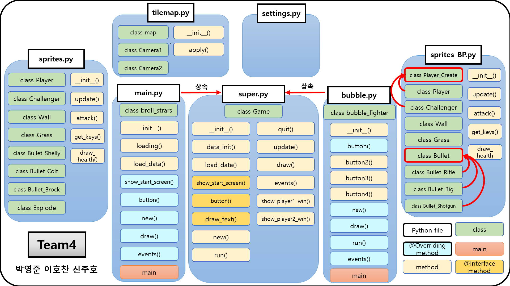

# Pygame_2019

HUFS ICE 인터넷 응용(3-1)

Team Project

박영준 이호찬 신주호

## Game #1 Brawl Stars

브롤스타즈를 모티브로 Map 과 Player1, 2 구현

>실행방법
>>server.py 실행 -> main.py 실행

>키 입력
>>

## Game #2 Bubble Fighter

버블파이터를 모티브로 Map과 Player1, 2 구현

만들었던 Game 1의 Soure Code를 Refactoring
Super Class를 정의하여 상속받아 구현

>실행방법
>>bubble.py 실행

>키입력
>>

## UML Diagram

